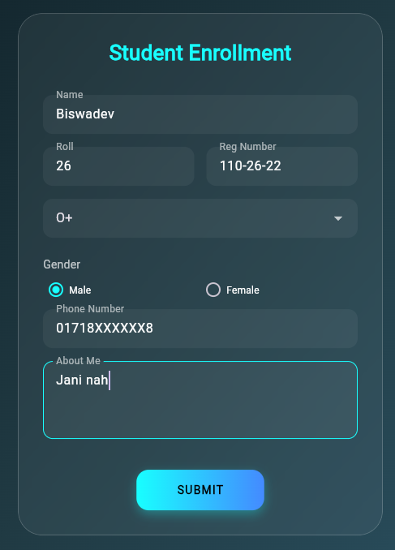
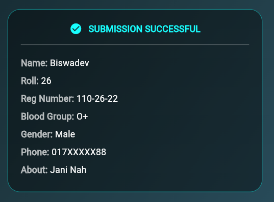

# Flutter Glassmorphism Student Form

A stylish, modern Student Registration Form built with Flutter. This project features a **Glassmorphism UI** design with a blurred background, custom gradients, and real-time form validation.

## ✨ Features
* **Glassmorphism Design:** Uses `BackdropFilter` for high-quality blur effects.
* **Form Validation:** Includes checks for Name, Roll, Registration, and Phone.
* **Smart Inputs:** Numeric keyboards for ID numbers and Tel keyboards for phone entries.
* **Interactive UI:** Pointer/Hand cursor on hover for the Submit button.
* **Auto-Reset:** The form automatically clears and displays submitted data below.

## 📸 Screenshots

| Submission Form | Success Output |
| :---: | :---: |
|  |  |

## 🚀 How to Run
1. Ensure you have Flutter installed.
2. Clone this repository.
3. Navigate to the project folder.
4. Run `flutter run`.

## 📁 Project Structure
* `lib/form_practice_01.dart`: Contains the main Glassmorphism logic.
* `practice-01_image/screenshots/`: Contains the UI previews.
